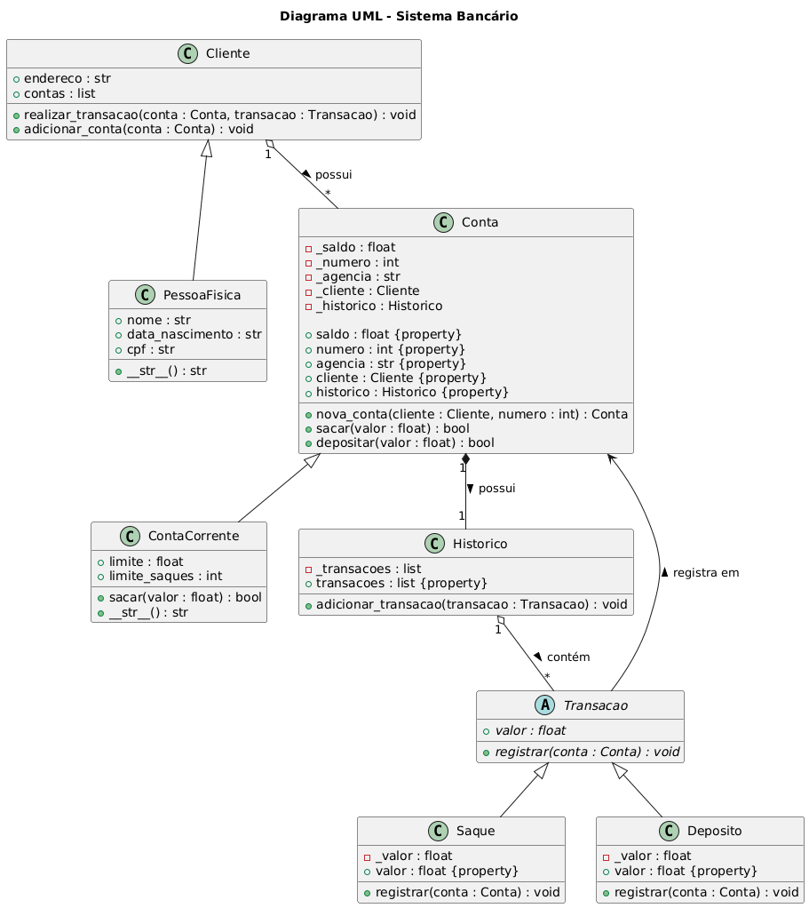

#  DIO - 💳 Sistema Bancário 3 em Python

<div align="center">
  
</div>

Este projeto é um sistema bancário simples desenvolvido em Python, com foco em orientação a objetos, encapsulamento e boas práticas de código. Ele permite o gerenciamento de clientes, contas correntes, depósitos, saques e extratos, tudo via terminal.

---

## 🚀 Funcionalidades

- Cadastro de clientes (Pessoa Física)
- Criação de contas correntes
- Realização de depósitos e saques
- Emissão de extrato com histórico de transações
- Listagem de clientes e contas
- Validação de entrada com tratamento de exceções

---

## 🧠 Estrutura do Código

### 🏦 Classes principais

- `Cliente`: Classe base para clientes, armazena endereço e contas.
- `PessoaFisica`: Herda de `Cliente`, adiciona nome, CPF e data de nascimento.
- `Conta`: Classe base para contas bancárias, com saldo, número, agência e histórico.
- `ContaCorrente`: Herda de `Conta`, com limite de saque e número máximo de saques.
- `Historico`: Armazena transações realizadas (saques e depósitos).
- `Transacao`: Classe abstrata para operações bancárias.
  - `Saque`: Implementa saque com validações.
  - `Deposito`: Implementa depósito com validações.

### 🧩 Funções utilitárias

- `menu()`: Exibe o menu principal.
- `depositar()`, `sacar()`, `exibir_extrato()`: Operações bancárias.
- `criar_cliente()`, `criar_conta()`: Cadastro de clientes e contas.
- `listar_clientes()`, `listar_contas()`: Exibição de dados.
- `obter_cliente_e_conta()`: Refatoração para evitar repetição de código.
- `limpar_tela()`, `pausar()`: Controle de interface no terminal.

---


## 📊 Diagrama UML do Sistema



## 🛡️ Tratamento de exceções

- Conversões de entrada (`float`, `int`) protegidas com `try/except`
- Validação de existência de cliente e conta antes de operações
- Mensagens amigáveis para entradas inválidas
- Método `obter_cliente_e_conta()` criado para centralizar validações

---

## 📦 Requisitos

- Python 3.7+
- Terminal interativo

---

## ▶️ Execução

Para rodar o sistema, basta executar o arquivo principal:

```bash
python nome_do_arquivo.py
```

---

## 📌 Observações

- O sistema não utiliza persistência de dados (banco ou arquivos).
- A data de nascimento é armazenada como string para exibição.
- O sistema foi projetado para uso interativo, não automatizado.

---

## ✨ Possíveis melhorias futuras

- Suporte a Pessoa Jurídica
- Persistência com SQLite ou arquivos JSON
- Interface gráfica com Tkinter ou PyQt
- Testes automatizados com `unittest` ou `pytest`

---

## 🎓 Sobre o projeto

Este projeto foi desenvolvido como parte do curso de Python da Plataforma [Digital Innovation One (DIO)](https://www.dio.me/). O código base seguiu as instruções das aulas, e foi posteriormente ajustado, refatorado e aprimorado por mim (Marcelo Carneiro) para fins de aprendizado e prática de boas práticas de programação.


